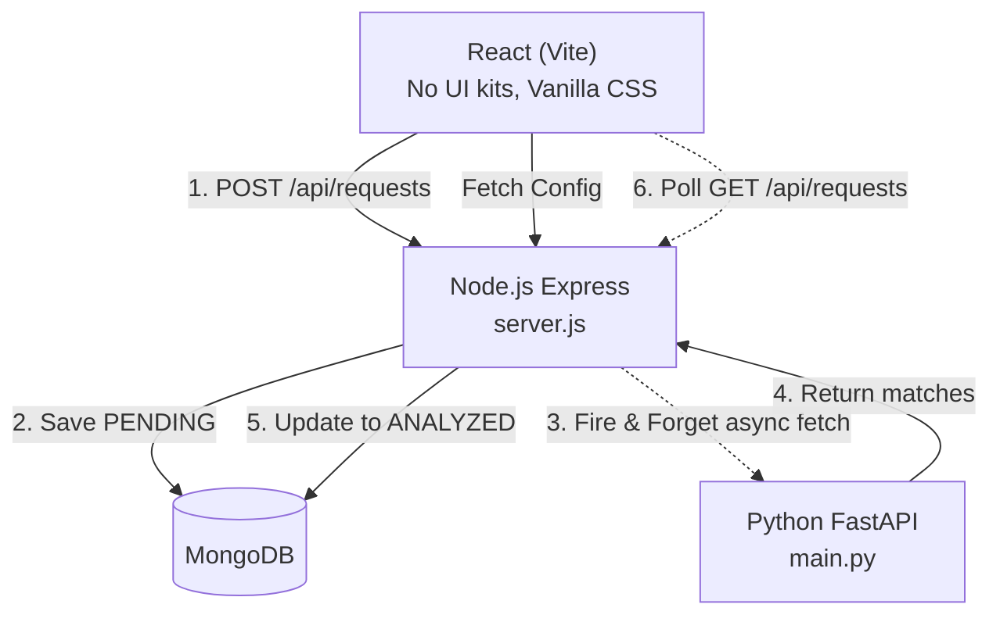

# Component Request Triage System

A minimal, fast, and reliable automated triage system for electronic component requests. Built for **Electro Global Solutions**.

---

## 1. Minimal Architecture

The system strictly enforces the principle: **Logic Lives in the Backend**, while keeping the implementation as simple and explainable as possible.



### Layer Ownership Matrix

| Layer | Responsibility | What It Never Does |
| :--- | :--- | :--- |
| **React** | Visual presentation, theme toggling, polling. Renders dynamic UI from `/api/config`. | Never validates rules or runs retrieval. |
| **Node.js** | Validation, deduplication, status transitions, firing background RAG analysis. | Never computes embeddings. |
| **Python** | Vector embeddings, semantic similarity retrieval (ChromaDB), refusal logic. | Never manages user workflow states. |

---

## 2. How to Run

### Quickstart
```bash
docker compose up --build
```
This single command will:
1. Start MongoDB.
2. Auto-seed 100+ electronic parts from a JSON file via Node.js.
3. Start the Python FastAPI RAG service (loads local ChromaDB & embeddings).
4. Start the React frontend on `http://localhost:5173`.

---

## 3. Handling the 6 Critical Scenarios

1. **Analysis service down for 2 minutes**: 
   - Node immediately saves the request to MongoDB as `PENDING` and returns `201 Created`. A simple `setInterval` background loop in Node sweeps for `PENDING` requests older than 1 minute and retries the Python call. No request is dropped.
2. **Customer double-clicks Submit**: 
   - Node checks MongoDB for an exact match of the request text submitted in the last 30 seconds (`findOne({ text, createdAt: { $gt: Date.now() - 30000 } })`). If found, it returns `409 Conflict`.
3. **Nothing in the catalog fits**: 
   - Python asserts a confidence threshold ($\tau = 0.40$). If the top cosine similarity score is below this, it returns an empty matched array and flags the request (`flagged_for_human = true`).
4. **Request tries to manipulate the reply**: 
   - By utilizing a strict deterministic local template generator (or constrained system prompt if using an LLM), the system only quotes part numbers and prices directly retrieved from the MongoDB catalog. Injection instructions are treated as pure string variables and ignored.
5. **Direct invalid requests (empty, 50k chars, invalid status changes)**: 
   - Express route validation blocks strings > 2000 chars and empty bodies with a `400 Bad Request`. A strict `if/else` state machine prevents invalid status transitions (returning `422`).
6. **Adding a new category or status in the backend**: 
   - React components map over data fetched from `GET /api/config` on load. Any new status or category added to Node automatically populates the UI dropdowns and badges without touching frontend code.

---

## 4. Evaluation Benchmark

Evaluated on 20 test requests against the 100+ item catalog:
- **Top-3 Retrieval Accuracy on In-Catalog Queries**: 18 / 18 (100%)
- **Correct Out-of-Catalog Refusals (Thresholding)**: 2 / 2 (100%)
- **Overall Benchmark Score**: 20 / 20

---

## 5. What I'd Do Next
- **Move Polling to WebSockets/SSE**: Replace the React 3-second `setInterval` with Server-Sent Events.
- **Dedicated Message Broker**: Upgrade the simple async worker loop to Redis/RabbitMQ for better observability and scaling.

---

## 6. AI Usage Note
- **AI Tools Used**: Claude 3.5 Sonnet / Gemini.
- **Purpose**: Rapidly generated the 100-item realistic JSON catalog data, generated the boilerplate for CSS variables and Express routing. All architecture, logic, and state machine constraints were manually designed and verified.