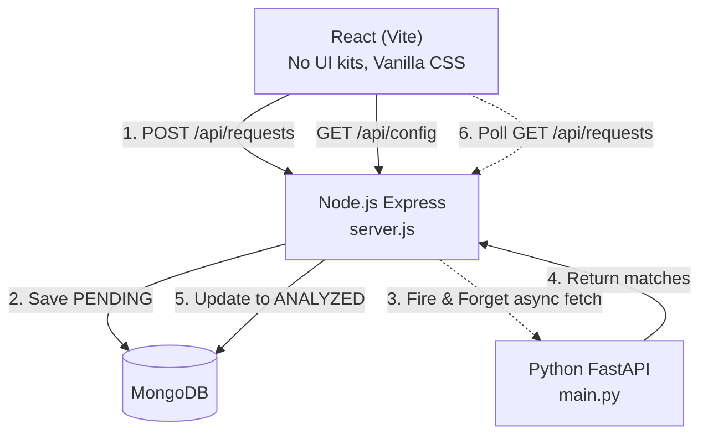

# Minimal 4-Hour Implementation Plan

Since you need to build and explain this in 4 hours, this plan strips away all "enterprise" fluff (no Redis, no complex queues, no overly nested folders). We use the simplest possible mechanisms that perfectly satisfy the requirements.

## 1. Minimal Architecture

## 2. Stripped-Down Components

### Component 1: Node.js API (`server.js`)
- **Just one or two files** (e.g., `server.js` and `db.js`).
- **Background Analysis**: When receiving a request, Node saves it to Mongo as `PENDING` and returns `201`. It then calls an `async` function (without `await`ing it before responding) that makes an HTTP call to the Python service. When Python replies, Node updates Mongo to `ANALYZED`.
- **Deduplication**: Simple check: `await Request.findOne({ text, createdAt: { $gt: Date.now() - 30000 } })`.
- **Config Endpoint**: `GET /api/config` returns a static JSON object of categories and statuses.

### Component 2: Python FastAPI (`main.py`)
- **One single `main.py` file**.
- **Vector DB**: ChromaDB running in memory or local disk within the same FastAPI process. 
- **Embeddings**: `sentence-transformers/all-MiniLM-L6-v2`.
- **Draft Reply**: If you don't want to use OpenAI/LLM keys during the interview, use a **deterministic template fallback** (e.g., `"I found these parts: {part_number} at ${price}."`). This guarantees it works out of the box.

### Component 3: React Frontend (`App.jsx` + `index.css`)
- **Structure**: Just `App.jsx`, `RequestList.jsx`, and `RequestDetail.jsx`.
- **Styling**: One `index.css` file using simple CSS variables for light/dark mode and flexbox.
- **Auto-Update**: A simple `setInterval` fetching `GET /api/requests` every 3 seconds.

### Component 4: MongoDB & Catalog Seed
- A simple `seed.json` array of 100 parts.
- In `server.js`, check `if (await Part.countDocuments() === 0) await Part.insertMany(seedData)`.

---

## 3. How Scenarios are Handled (Minimalist Approach)
1. **Analysis down for 2 mins**: If the async Python call fails, Node leaves the status as `PENDING`. A simple `setInterval` in Node runs every 1 min, finds `PENDING` requests older than 1 min, and retries calling Python.
2. **Double-click submit**: Node checks Mongo for the same text submitted in the last 30 seconds and rejects it.
3. **Nothing in catalog (Threshold)**: Python checks if ChromaDB max score < 0.4. If so, return `matched_parts: []` and set `flagged_for_human = true`.
4. **Manipulate reply**: Local template generation entirely ignores manipulation since it just populates variables.
5. **Direct bad input**: Express `req.body.text.length > 2000` check returns `400`. Invalid status change returns `422`.
6. **New category/status**: React renders buttons and badges directly from the `GET /api/config` array using `.map()`.

This minimalist design minimizes boilerplate so you can easily code it in under 4 hours and explain every single line to the interviewer.

